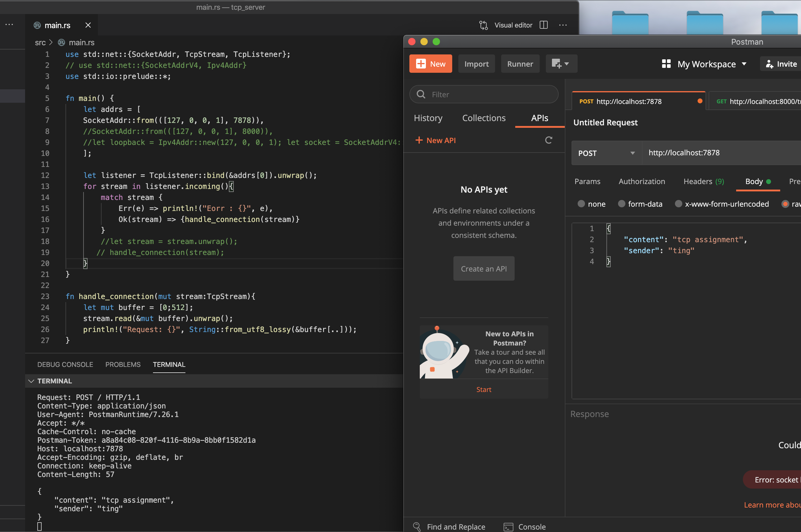

# 第三课作业 tcp_server

使用 Rust std 标准库的功能实现一个 tcp server，可参考网上代码自行修改，最终需要各位同学上传代码和运行结果的截图。

要求：
1、能正常运行；
2、对 tcp client（比如可用 telnet 等）发过来的消息，打印，并做 echo 返回；
3、对代码每一句做注解；
4、做一次标准的错误处理（模式匹配）。

希望各位同学通过本次作业，大家可以：
1、理解Rust中的基本结构用法
2、理解Rust中的基本控制流程用法
3、理解基本的模式匹配
4、理解错误处理的基本模式
5、了解标准库中的一些功能

